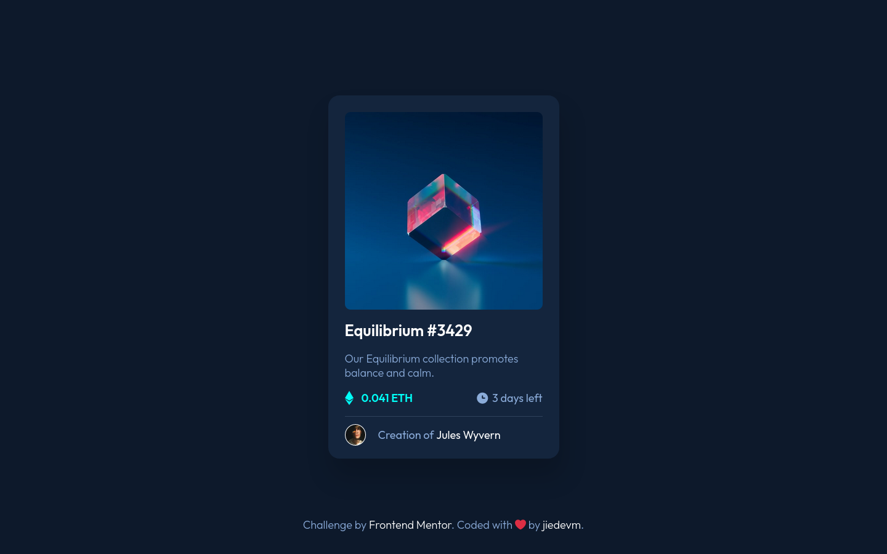

# Frontend Mentor - NFT preview card component solution

This is a solution to the [NFT preview card component challenge on Frontend Mentor](https://www.frontendmentor.io/challenges/nft-preview-card-component-SbdUL_w0U). Frontend Mentor challenges help you improve your coding skills by building realistic projects.

## Table of contents

-   [Overview](#overview)
    -   [The challenge](#the-challenge)
    -   [Screenshot](#screenshot)
    -   [Links](#links)
-   [My process](#my-process)
    -   [Built with](#built-with)
    -   [What I learned](#what-i-learned)
-   [Author](#author)

## Overview

### The challenge

Users should be able to:

-   View the optimal layout depending on their device's screen size
-   See hover states for interactive elements

### Screenshot



### Links

-   Solution URL: [https://github.com/dieudonneallognon/nft-preview-card-component](https://github.com/dieudonneallognon/nft-preview-card-component)
-   Live Site URL: [https://dieudonneallognon.github.io/nft-preview-card-component/](https://dieudonneallognon.github.io/nft-preview-card-component/)

## My process

### Built with

-   Semantic HTML5 markup
-   CSS custom properties
-   Flexbox
-   [Less](https://lesscss.org/) CSS Precompiler
-   [Gulp](https://gulpjs.com/) task Manager
-   Mobile-first workflow

### What I learned

-   [Less](https://lesscss.org/) CSS Precompiler

Aiming to gain more productivity while coding, I used the less css precompiler
to reduce the amount of time and lines of css code I write. I have then an
index.less file which is transpiled in index.css.

```less
/* index.less */

html {
    min-width: 375px !important;
    min-height: 664px !important;
    max-width: 1440px;

    width: 100%;
    height: 100%;
    margin: auto;

    body {
        background-color: var(--main-very-dark-blue);
        display: flex;
        align-items: center;
        justify-content: center;
        flex-direction: column;
        height: 100%;
        max-width: 375px;
        margin: auto;
        ...;
    }
}
```

-   [Gulp](https://gulpjs.com/) task Manager

Since code transpiling is not automatic, I used The Gulp task manager to watch
my less file and automate the transpilation process when a the less file when it
detects modification

```js
/* gulpfile.js */

exports.watch = () => watch("src/*.less", compileCss);
```

## Author

-   Github - [dieudonneallognon](https://github.com/dieudonneallognon/)
-   Frontend Mentor - [@dieudonneallognon](https://www.frontendmentor.io/profile/dieudonneallognon)
-   LinkedIn - [Dieudonné ALLOGNON](https://www.linkedin.com/in/dieudonn%C3%A9-allognon-200239175/)
